# 0day — CTF Writeup

A walkthrough of a vulnerable Linux machine (hostname/profile page: **0day**), exploited from initial web enumeration through to root, using a classic **Shellshock (CVE-2014-6271)** remote code execution flaw and a **kernel privilege escalation** exploit.

> **Flags**
> - User: `THM{Sh3llSh0ck_r0ckz}`
> - Root: `THM{g00d_j0b_0day_is_Pleased}`

---

## Table of Contents

- [Tools Used](#tools-used)
- [1. Reconnaissance](#1-reconnaissance)
- [2. Web Enumeration](#2-web-enumeration)
- [3. Dead Ends](#3-dead-ends)
- [4. Second Round of Enumeration](#4-second-round-of-enumeration)
- [5. Identifying the Vulnerability — Shellshock](#5-identifying-the-vulnerability--shellshock)
- [6. Exploitation with Metasploit](#6-exploitation-with-metasploit)
- [7. Initial Foothold & User Flag](#7-initial-foothold--user-flag)
- [8. Privilege Escalation](#8-privilege-escalation)
- [Lessons Learned](#lessons-learned)

---

## Tools Used

| Tool | Purpose | Why It Was Used |
|------|---------|------------------|
| **Nmap** | Port & service scanning | Identify open ports and running services (SSH, HTTP) and fingerprint the OS/service versions |
| **Gobuster** | Directory/file brute-forcing | Discover hidden directories on the web server (`admin`, `backup`, `secret`, `cgi-bin`, etc.) |
| **Firefox (manual browsing)** | Web application review | Manually inspect discovered directories/pages for clues, files, and dead ends |
| **ssh2john** | Hash extraction | Convert the encrypted RSA private key found on the server into a crackable hash format |
| **John the Ripper** | Password cracking | Crack the passphrase protecting the RSA private key using the `rockyou.txt` wordlist |
| **Nikto** | Web server vulnerability scanning | Perform an automated scan for outdated software, misconfigurations, and interesting paths |
| **Searchsploit (Exploit-DB)** | Exploit research | Identify public exploits for the outdated Apache/CGI configuration (Shellshock) |
| **Metasploit Framework (msfconsole)** | Exploitation | Reliable, configurable exploitation of the Shellshock vulnerability against the CGI endpoint |
| **Meterpreter** | Post-exploitation shell | Interact with the compromised host, browse the filesystem, and retrieve the user flag |
| **curl / wget** | File transfer | Attempt to pull privilege escalation scripts (`linpeas.sh`) and exploit code onto the target |
| **Python 3 `http.server`** | File hosting | Serve exploit code from the attacking machine when `curl`-based transfer of `linpeas.sh` failed |
| **GCC** | Compilation | Compile the downloaded kernel exploit (`37292.c`) directly on the target |

---

## 1. Reconnaissance

An `nmap` version scan against the target revealed two open ports:

| Port | Service | Version |
|------|---------|---------|
| 22   | SSH     | OpenSSH 6.6.1p1 (Ubuntu 2ubuntu2.13) |
| 80   | HTTP    | Apache httpd 2.4.7 (Ubuntu) |

The host was fingerprinted as an Ubuntu Linux system, with Apache serving the primary attack surface.

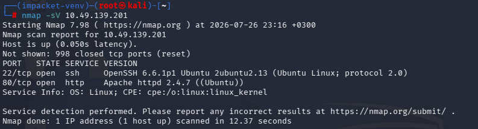
*nmap -sV scan showing SSH and HTTP open on the target.*

---

## 2. Web Enumeration

`Gobuster` was run against the web root using the `directory-list-lowercase-2.3-medium.txt` wordlist, uncovering several directories:

```
cgi-bin/   img/   uploads/   admin/   css/   js/   backup/   secret/
```

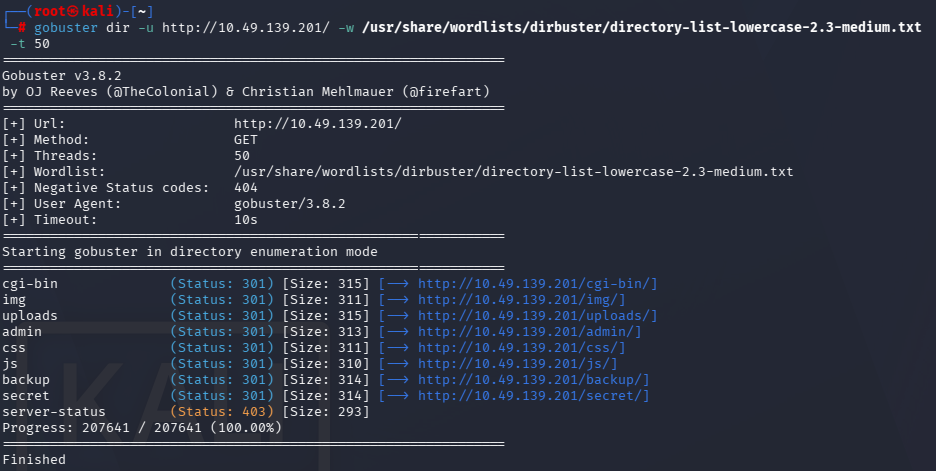
*Gobuster output revealing hidden directories on the web server.*

Browsing to the site's root revealed a personal landing page themed **"0day"**, attributed to *Ryan Montgomery*, with links to social profiles — this became the working name for the box.

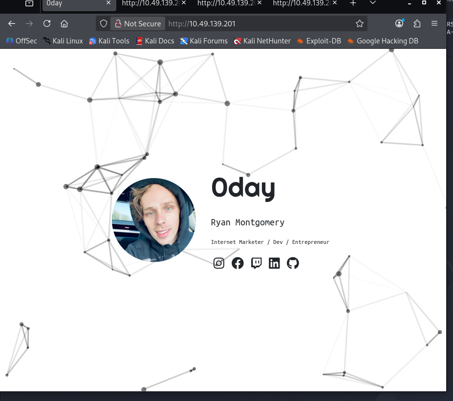
*The "0day" profile landing page discovered at the web root.*

---

## 3. Dead Ends

Several of the discovered directories initially looked promising but did not lead anywhere directly:

- **`/backup/`** contained an **encrypted RSA private key**.

  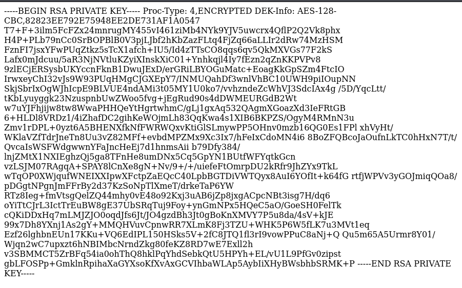
  *Encrypted RSA private key found inside the `/backup/` directory.*

  `ssh2john` was used to extract a crackable hash:

  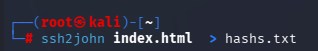
  *Using ssh2john to convert the private key into a John-crackable hash.*

  `John the Ripper` then cracked the passphrase against `rockyou.txt` in under a second:

  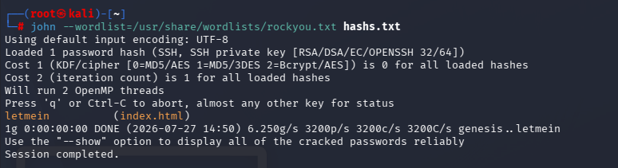
  *John the Ripper recovers the passphrase `letmein` almost instantly.*

  However, the recovered key/passphrase combination did **not** grant SSH access — this turned out to be a decoy.

- **`/secret/`** simply served a harmless turtle image with no further clues.

  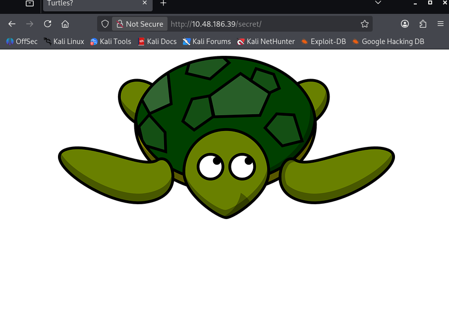
  *The `/secret/` directory — a red herring, just a turtle image.*

These paths were noted and set aside as red herrings rather than being pursued further.

---

## 4. Second Round of Enumeration

Enumeration continued against the target (now observed at `10.48.186.39`), following the same methodology:

- **`robots.txt`** returned a taunting message rather than useful disallowed paths — another dead end/troll entry.

  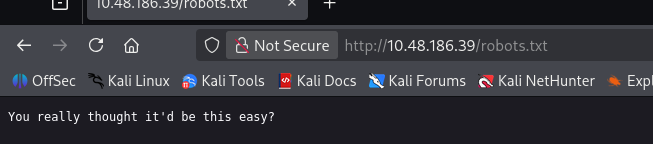
  *robots.txt returning a sarcastic message instead of useful paths.*

- **`/secret/`** again returned the turtle image.

- **`/cgi-bin/`** returned a `403 Forbidden`, but this confirmed that **CGI script execution was enabled** on the server — a key detail, since Shellshock specifically targets CGI handlers that pass HTTP headers into Bash as environment variables.

  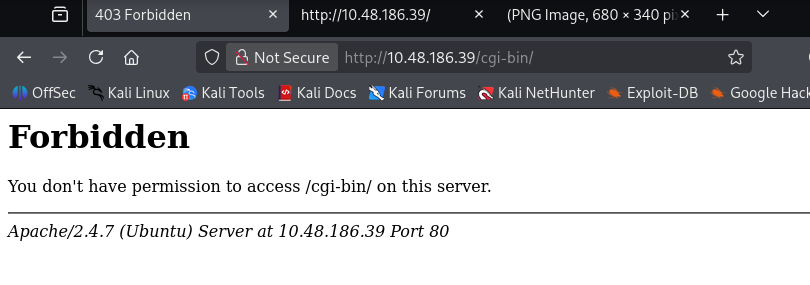
  *`/cgi-bin/` returns 403 Forbidden, confirming CGI handling is active on the server.*

An `Nikto` scan against the host reinforced these findings, flagging outdated Apache, missing security headers, and several interesting paths:

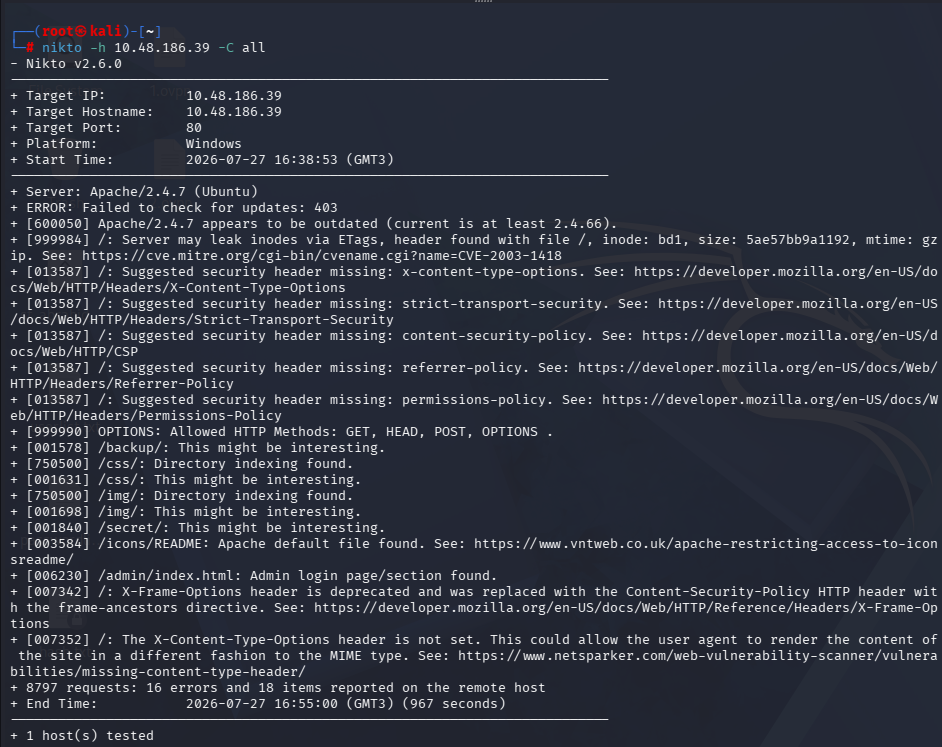
*Nikto scan flagging Apache 2.4.7 as outdated along with several interesting directories.*

The combination of an outdated Apache version and an accessible `cgi-bin` directory pointed strongly toward a **Shellshock** vulnerability.

---

## 5. Identifying the Vulnerability — Shellshock

**Shellshock (CVE-2014-6271)** is a critical Bash vulnerability where specially crafted environment variables cause Bash to execute trailing commands. Since CGI scripts pass HTTP headers (like `User-Agent`) into Bash as environment variables, an attacker can smuggle arbitrary shell commands into an HTTP request and have them executed on the server — resulting in **Remote Code Execution**.

`searchsploit` was used to search for relevant CGI/Apache exploits:

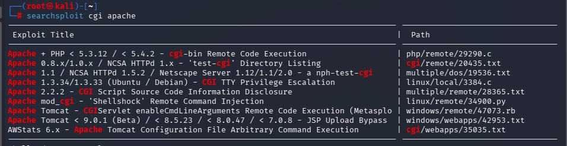
*searchsploit results for "cgi apache", surfacing several candidate exploits.*

This surfaced a Python-based Shellshock exploitation script targeting `mod_cgi`:

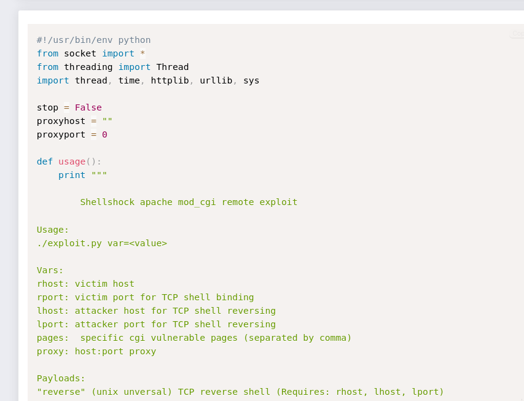
*Shellshock apache mod_cgi remote exploit script found on Exploit-DB.*

In parallel, `msfconsole` was searched for a more reliable, configurable option:

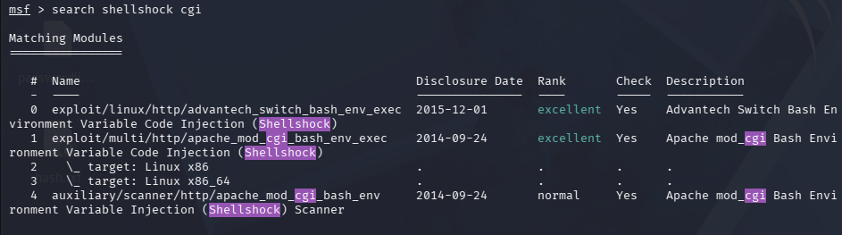
*Searching Metasploit for "shellshock cgi", returning the apache_mod_cgi_bash_env_exec module.*

---

## 6. Exploitation with Metasploit

The module `exploit/multi/http/apache_mod_cgi_bash_env_exec` was configured with the target's RHOSTS, the CGI target URI, and reverse shell payload options:

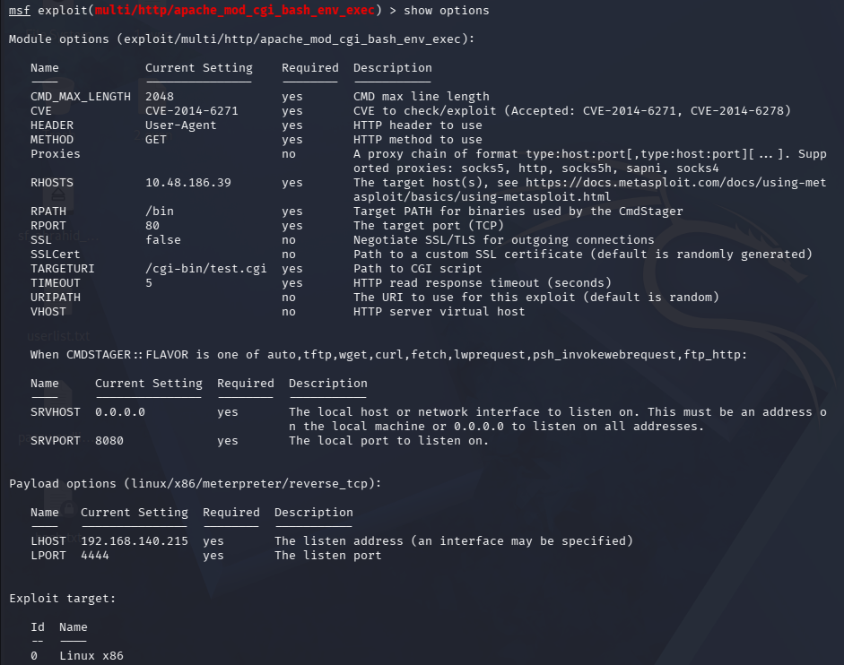
*Configured options for the apache_mod_cgi_bash_env_exec exploit module.*

Before firing the exploit, the target CGI script was confirmed to exist and to be a simple Bash script (`test.cgi`) — exactly the kind of script vulnerable to environment variable injection:

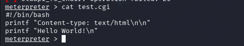
*Confirming the vulnerable test.cgi script content via Meterpreter.*

Running the exploit successfully returned a **Meterpreter session**, and dropping into a shell confirmed code execution as `www-data`:

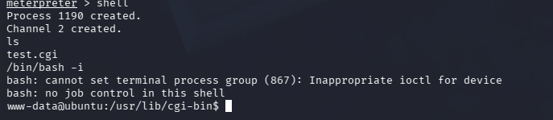
*Meterpreter shell dropped into a system shell, landing as www-data.*

---

## 7. Initial Foothold & User Flag

From the shell, navigating to `/home/ryan` revealed the user flag:

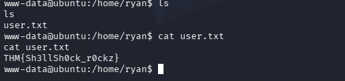
*Reading user.txt from Ryan's home directory — user flag captured.*

---

## 8. Privilege Escalation

With a foothold as `www-data`, the next step was to enumerate the system for privilege escalation opportunities.

An initial attempt to pull and run `linpeas.sh` via `curl` failed to transfer any data (0 bytes received), likely due to a network/hosting issue on the attacking side:

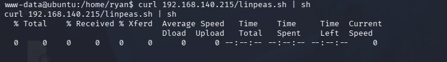
*Attempting to pull and run linpeas.sh directly via curl — the transfer stalls at 0 bytes.*

Manual enumeration of the kernel version instead revealed a known-vulnerable kernel:

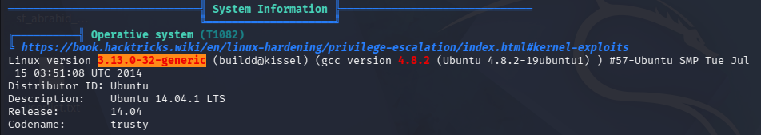
*Kernel identified as 3.13.0-32-generic on Ubuntu 14.04.1 LTS "trusty".*

This is a kernel version known to be vulnerable to **CVE-2015-1328**, a local privilege escalation flaw in **overlayfs**, affecting Ubuntu kernels `3.13.0 < 3.19` (Exploit-DB ID `37292`).

A Python 3 HTTP server (`python3 -m http.server 9999`) was started on the attacking machine to host the exploit source code, and the target successfully retrieved it via `wget`/`curl`:

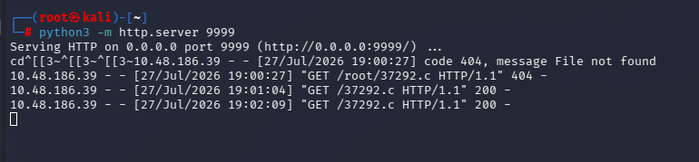
*Serving 37292.c from the attacking machine; access logs confirm the target retrieved it successfully.*

Since the `www-data` user had no write permission in `/home/ryan`, the exploit was downloaded, compiled, and executed from **`/tmp`**:

```
gcc 37292.c -o 37292
./37292
```

This dropped into a root shell, which was confirmed and used to retrieve the root flag:

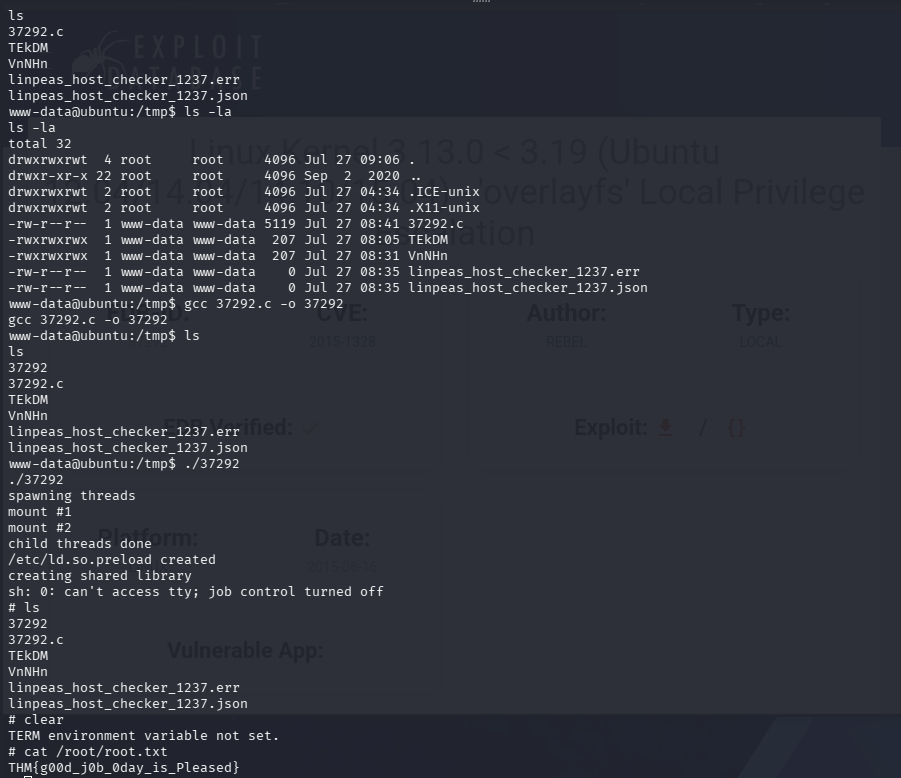
*Compiling and running the overlayfs exploit (37292.c) in /tmp, escalating to root and reading root.txt.*

```
# cat /root/root.txt
THM{g00d_j0b_0day_is_Pleased}
```

---

## Lessons Learned

- **Not every discovered file/directory is meaningful** — the encrypted RSA key and turtle image were deliberate distractions; time is better spent validating whether a lead actually advances access before investing heavily in it.
- **Outdated software + enabled CGI = high risk.** A five-minute Nikto scan combined with basic directory enumeration was enough to flag the exact vulnerability class needed.
- **Shellshock remains a great teaching example** of how insufficient input sanitization (in this case, of environment variables) can escalate from a header value to full remote code execution.
- **Kernel version enumeration is a cheap, high-value step** in privilege escalation — a stock `uname -a` immediately pointed to a known, weaponized local exploit.
- **Write permissions matter during exploitation** — when `/home/ryan` wasn't writable, `/tmp` was the natural fallback for compiling and running the escalation exploit.

---
