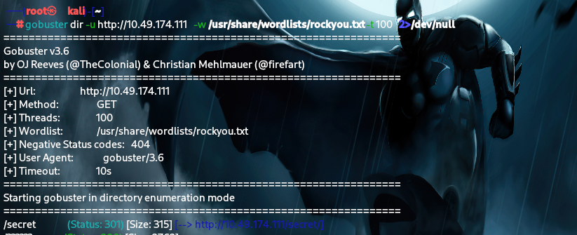
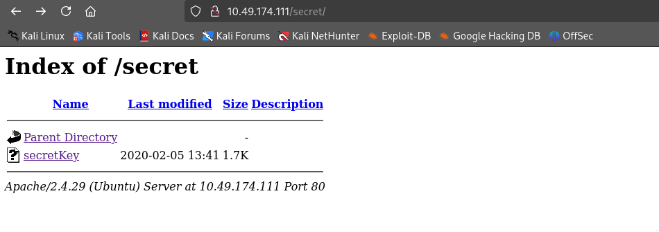
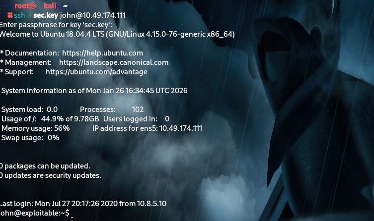
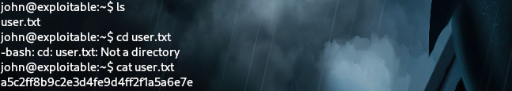

TRYHACKME CFT - GAMING SERVER

WE connect to the ip address through tunneling 
Begin with scanning the ip address:- 

We can see tht 2 ports are open 
22 for ssh & 80 for the apache server

so then  figure  if something is there in the apache server:-

We inspected the view source page:-

ohh ....prolly the Name of the user be john 

try finding out any subdirectories this server has using gobuster:-

AFter trying to find subdirectories we got /secret

After checking over the file secret key , it gives a rsa key to the ssh 
We can copy the key and save it in some file 

sec.key 

which has to be converted into hash
using  ssh2john seckey > sec.hash 

and then 
try decrypting the sec.hash to find paraphrase

john sec.hash   --wordlist=/usr/share/wordlists/rockyou.txt

ones, done we need to give the file permission chmod 600

 
try login in into the ssh

yesss.. we entered the ssh

check for any user flag

