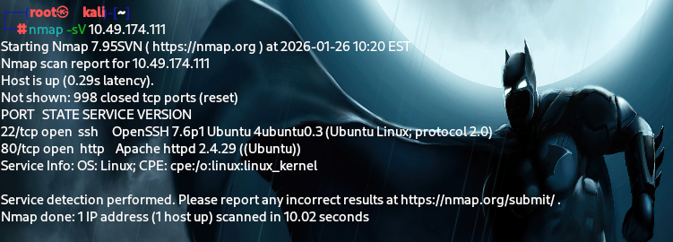
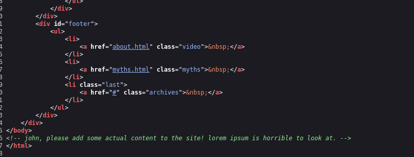

TRYHACKME CFT - GAMING SERVER

WE connect to the ip address through tunneling 
Begin with scanning the ip address:- 

We can see tht 2 ports are open 
22 for ssh & 80 for the apache server

so then  figure  if something is there in the apache server:-

We inspected the view source page:-

ohh ....prolly the Name of the user be john 

