1. Initial Reconnaissance
Tools used: nmap

First, I performed a basic port scan to identify open services:
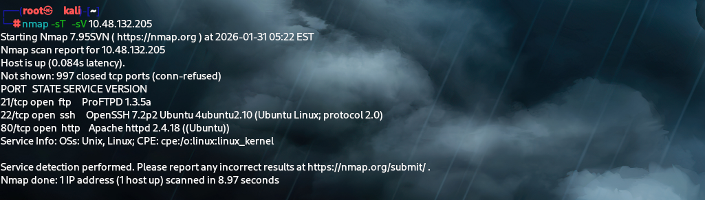

2.WEB Page

After,view over the source page I discovered something:

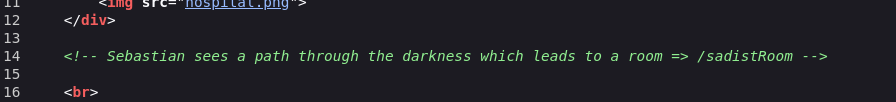

There is a subdirectory lets see whats there i typed and went on the site:
IT gave a key

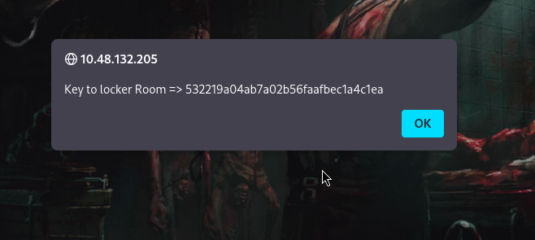

I get a link below on the same page and enter the key;
which lead us to new page:

It takes us to a locker room with some fishy text in content.
I decrypted it, it was a cipher text
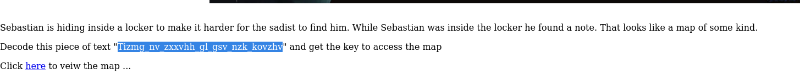

where it showed a slot to enter the decyrpted key:

which took us to a safe room.

After tht i again checked the source code because I couldnt find much in the main page:
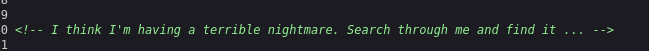

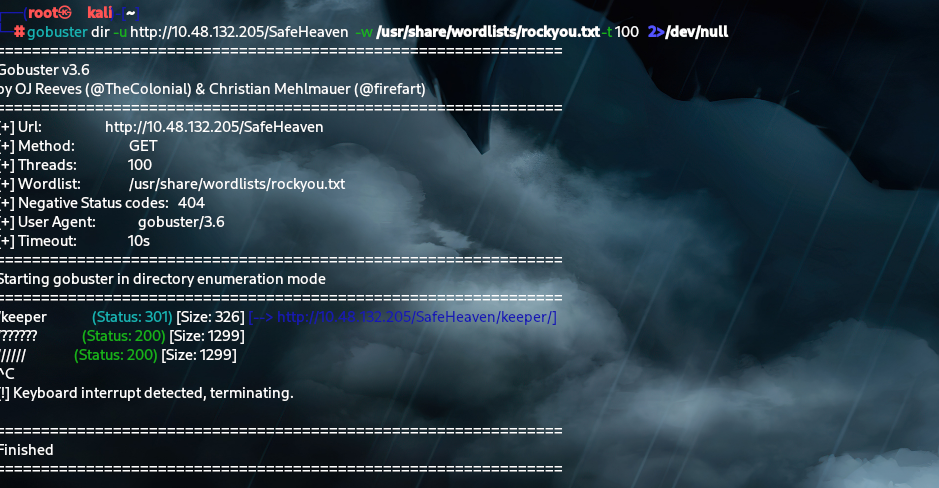

!!!! i got a /keeper directory.

So i came out with and idea of finding subdirectories in safeheaven page:

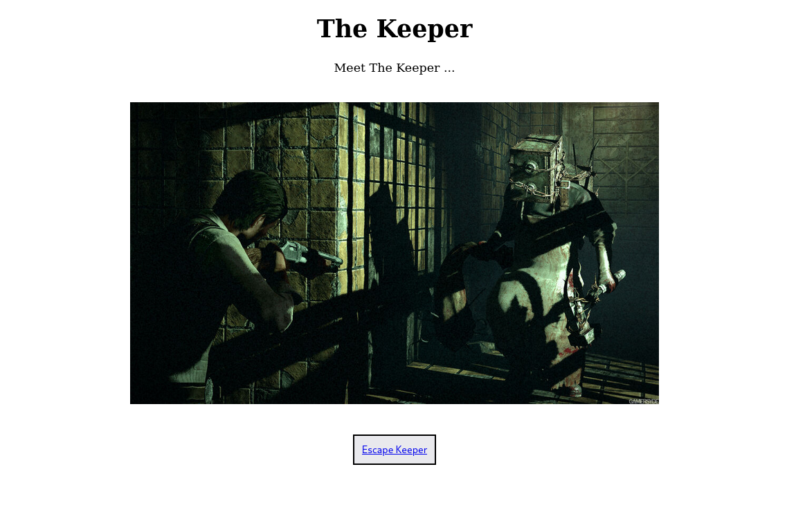

after clicking on the button below we get a timer for the picture I again check soruce page and it said:

It had a image to search on google:

After giving the key it takes me to "Abandoned room"

In the source page it mentions abt shell, After abit of research I felt it was shell command on the url so used it with ls command:

!!!!oh we got it :

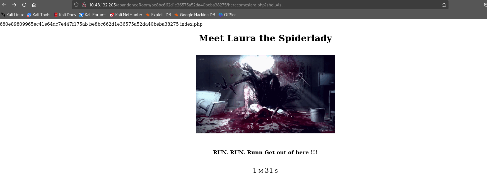

after tht went i checked it on URl :
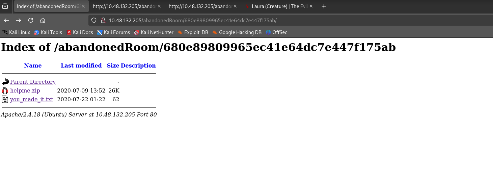

downloaded those files and checked it

unziped the file:
and we gwt key.wav after checking over the unziped file which had image:
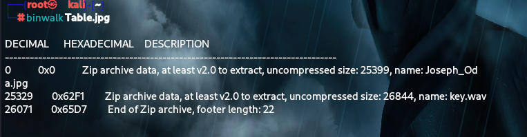

Tried decyrpting the key.wav

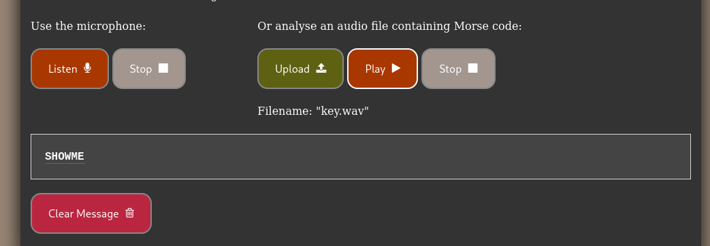

The photo was stegnograph

so we cracked it:

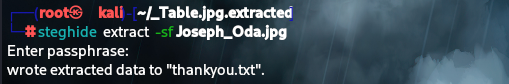

That gave us the password to ftp server where we got  new files:

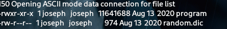

had to built a Python program to execute one of the program file in it and we got the user and password was decrypted using multi type SMS text:

and we got access to ssh:

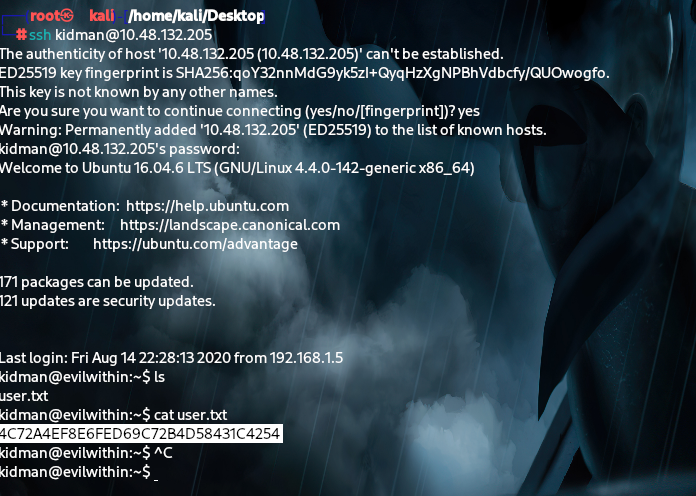

and we got user flag :

I went on to search for priv sec and i got it from crontab where u can use a file for it:

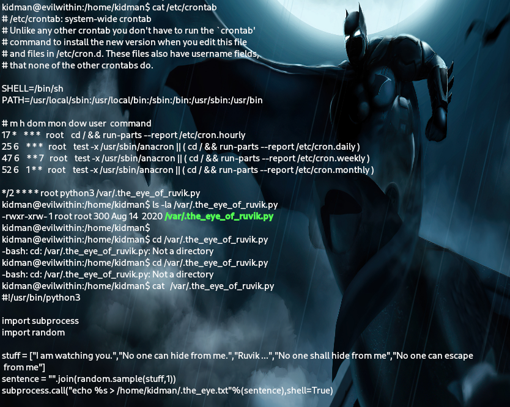

Used a bash command from gitfobin to change the file and opened a port listener:

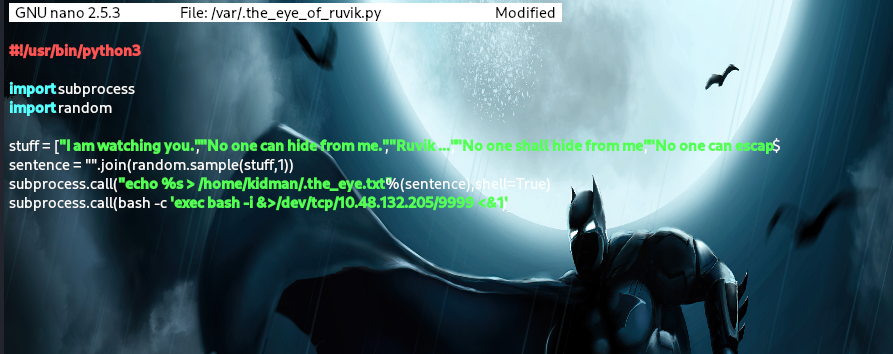

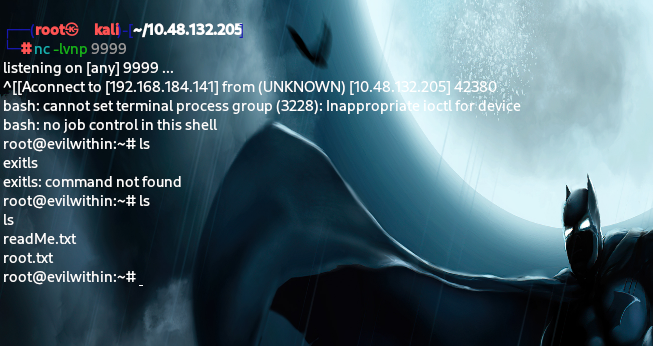

and I got the root.txt:

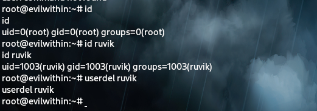

